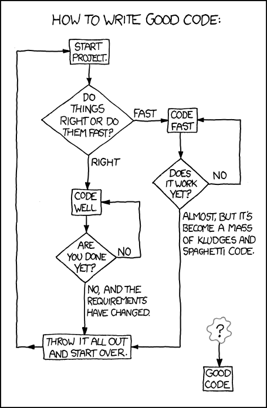

class: center, middle

# An Introduction to Functional Programming
## Zainab Ali
### https://zainab-ali.github.io/introduction-to-functional-programming-in-rust

---
class: center, middle


<footer style="font-size: 14px">Source: edwardmonkton.com</footer>

---
class: center, middle

# Why functional programming?
## Ease of reasoning
---
class: middle
# Agenda
 - 🎂 Design a basic app
 - 🐛 Hunt for a bug
 - λ  Rewrite with FP techniques

---
class: middle

# Birthday app  

## Today is 6th August 2024.

```bash
./birthday 2000-08-06   # My birthday is today
Happy birthday! Congratulations on becoming 24!
```

```bash
./birthday 2000-08-08   # My birthday is soon
It's not your birthday yet. Wait for 2 more days.
```

```bash
./birthday 2000-08-05   # My birthday was yesterday
You've already had your birthday. I hope you had fun!
```

---
class: middle

# Rule

## If it's not my birthday yet, I should wait for at least one day.

---
class: middle

# 🐛 The bug

## It's close to midnight on the 5th August.
```bash
./birthday 2000-08-06
It's not your birthday yet. Wait for 0 more days.
```


---
class: middle
```rust
fn main() -> () {
    if birthday() == today() {
        println!("Happy birthday! Congratulations on becoming {}!", age());
    } else {
        if birthday() < today() {
            println!("You've already had your birthday. I hope you had fun!")
        } else {
            println!(
                "It's not your birthday yet. Wait for {} more days.",
                days_until_birthday()
            );
        }
    }
}

```
---
class: middle


```rust
fn today() -> NaiveDate {
    Utc::now().date_naive()
}
```

```rust
fn birthday(today: NaiveDate) -> NaiveDate {
    date_of_birth().with_year(today.year()).unwrap()
}
```

```rust
fn date_of_birth() -> NaiveDate {
    let date_string = std::env::args().nth(1).unwrap();
    NaiveDate::parse_from_str(&date_string, "%Y-%m-%d").unwrap()
}
```

---
class: middle

# Functional programming techniques
 - Write pure functions
 - Identify side effects
 - Modelling data with types
 - Write total functions
 
---
class: middle
# Pure functions

```rust
let x = 1 + 2;
// Is equivalent to
let x = 3;
```
```rust
let is_empty = Some(5).is_empty();
// Is equivalent to
let is_empty = false;
// And also equivalent to
let is_empty = match Some(5) {
 Some(_) => false,
 None => true
};
```
???

TODO: check this match statement compiles

---
class: middle
# Side effects

```rust
let x = println!("Happy birthday!");
// Is not equivalent to
let x = ();
```

```rust
let x = today();
// Is not equvalent to
let x = NaiveDate::of_ymd(2024,08,06);
```

```rust
let x = sys::env::args();
// Is not equivalent to
let x = vec!["birthday", "2024-08-06"];
```
---
class: middle

# λ Rewriting the code

```rust
fn main() -> () {
    // Side effects
    let today = get_today();
    let dob_string = get_arg();
	// Pure code
    let dob = calc_dob(dob_string);
    let birthday = calc_birthday(today, dob);
	// Printing
    if birthday == today {
	   ...
    } else if birthday < today {
	   ...
    } else {
        println!(
            "It's not your birthday yet. Wait for {} more days.",
            calc_days_until_birthday(today, birthday)
        );
    }
}
```

---
class: middle

# Pure functions
## No side effects
 - `calc_dob`
 - `calc_days_until_birthday`
 - `calc_birthday`
 
## Side effects
 - `get_arg`
 - `get_today`
 
---
class: middle
# Tests

```rust
    #[test]
    fn test_days_until_birthday() {
        let today = NaiveDate::from_ymd(2024, 08, 05);
        let birthday = NaiveDate::from_ymd(2024, 08, 26);
        let result = calc_days_until_birthday(today, birthday);
        assert_eq!(result, 1);
    }
```

---
class: middle
# Tests?

```rust
    if birthday == today {
        println!(
            "Happy birthday! Congratulations on becoming {}!",
            calc_age(today, dob)
        );
    } else if birthday < today {
        println!("You've already had your birthday. I hope you had fun!")
    } else {
        println!(
            "It's not your birthday yet. Wait for {} more days.",
            calc_days_until_birthday(today, birthday)
        );
    }
```

---
class: middle
# Modelling output

```rust
enum Message {
    HappyBirthday { age: u32 },
    HadBirthday,
    Wait { days: u32 },
}
```

```rust
// Pure
fn calc_message(dob_string: Option<String>, today: NaiveDate) -> Message
```
```rust
// Side effects
fn print_message(message: Message) -> ()
```

---
class: middle
```rust
fn calc_message(dob_string: Option<String>, today: NaiveDate) -> Message {
    let dob = calc_dob(dob_string);
    let birthday = calc_birthday(today, dob);
    if birthday == today {
        Message::HappyBirthday {
            age: calc_age(today, dob),
        }
    } else if birthday < today {
        Message::HadBirthday
    } else {
        Message::Wait {
            days: calc_days_until_birthday(today, birthday),
        }
    }
}
```
---
class: middle

```rust
fn print_message(message: Message) -> () {
    match message {
        HappyBirthday { age } => 
		  println!("Happy birthday! Congratulations on becoming {}!", age),
        HadBirthday => 
		  println!("You've already had your birthday. I hope you had fun!"),
        Wait { days } => 
		  println!("It's not your birthday yet. Wait for {} more days.", days),
    }
}
```
---
class: middle
# Summary

```rust
fn main() -> () {
    // Side effects
    let today = get_today();
    let dob_string = get_arg();
    // Pure
    let message = calc_message(dob_string, today);
    // Side effects
    print_message(message);
}
```

---
class: middle
# Recap
 - pure functions
 - side effects
 - modelling data
---
class: middle
# 🐛 More problems

```bash
./birthday 2030-08-06
panic!
```

```bash
./birthday 2000-42-50
panic!
```

```bash
./birthday tomorrow
panic!
```
???

TODO We're ignoring leap years for now
---
class: middle

# Panic if 
 - I was born on a nonsensical date.
 - I will be born in the future.
 - I will be born `"tomorrow"`.

---
class: middle

# Totality
## An output for all possible inputs
---
class: middle

# Result

```rust
enum Error {
    NoDateOfBirth,
    BadDateOfBirth(String),
    BornInTheFuture,
}
```

```rust
fn calc_message(dob_string: Option<String>, 
                today: NaiveDate) -> Result<Message, Error>
				
```

```rust
fn calc_dob(dob_string: Option<String>, 
            today: NaiveDate) -> Result<NaiveDate, Error>
```

---
class: middle

```rust
fn calc_message(dob_string: Option<String>, 
                today: NaiveDate) -> Result<Message, Error> {
    let dob = calc_dob(dob_string, today)?;
    let birthday = calc_birthday(today, dob);
    let message = ...
	Ok(message)
}
```

---
class: middle

# Tests

```rust
    #[test]
    fn born_in_future() {
        let today = NaiveDate::from_ymd(2025, 01, 01);
        let result = calc_message(Some("2030-06-15".to_string()), today);
        assert_eq!(result, Err(Error::BornInTheFuture));
    }
```

---
class: middle

# We've learned to...
 - Write pure functions
 - Identify side effects
 - Model data
 - Write total functions
 
## Write bug-free testable code

---
class: center, middle




<footer style="font-size: 14px">Source: xkcd.com</footer>

---
class: middle

# Find me
 - Newsletter: [buttondown.email/zainab](https://buttondown.email/zainab)
 - Email: zainab@duskimpression.com
 - LinkedIn: [zainab-ali-fp](https://uk.linkedin.com/in/zainab-ali-fp)
 - GitHub: zainab-ali

---
class: center, middle
# Thank you!
## Questions?
### https://zainab-ali.github.io/introduction-to-functional-programming-in-rust
